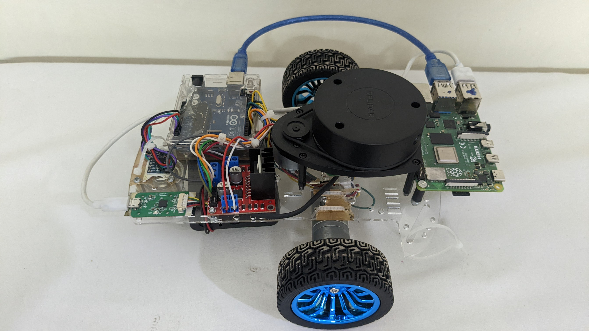
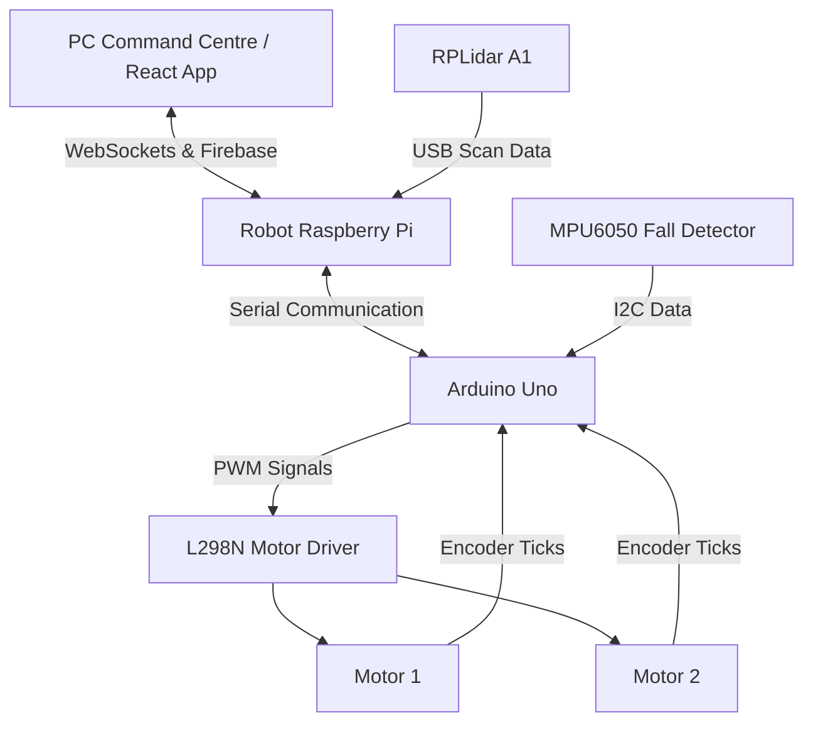
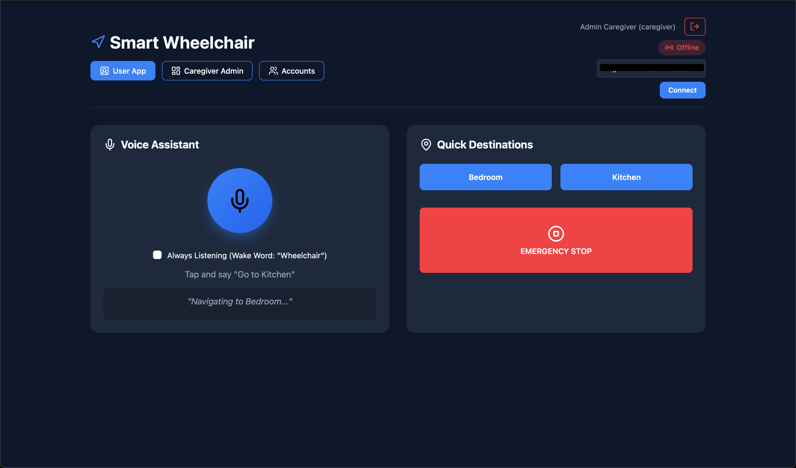
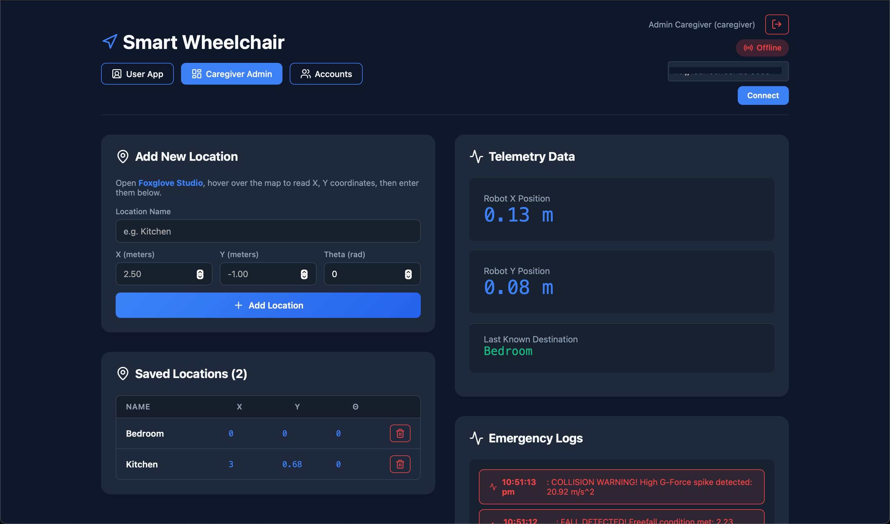
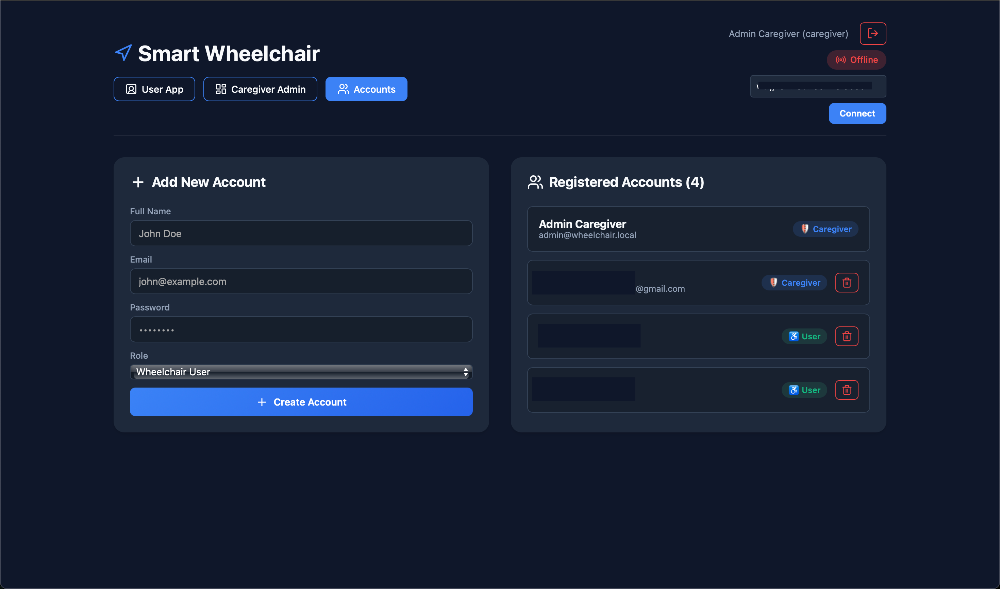

# ROS 2 Autonomous Smart Wheelchair ♿🤖

<div align="center">
  <!-- 📸 Physical Wheelchair Hero Image -->
  
  <p><i>The fully assembled, custom-built autonomous smart wheelchair hardware platform.</i></p>
</div>

An end-to-end **Autonomous Smart Wheelchair** powered by ROS 2 (Humble), Raspberry Pi 4, and 2D LiDAR. 

This assistive technology project features room-to-room predictive navigation, real-time hardware fall detection, and a React-based Web Dashboard allowing the user to control the chair entirely with their voice, while Caregivers can track the chair remotely.

---

## ✨ Key Features
- **Predictive Autonomous Navigation**: Powered by the official ROS 2 `Nav2` stack and Google Cartographer for 2D Simultaneous Localization and Mapping (SLAM).
- **Remote Telemetry Dashboard**: A React + Vite web application synced in real-time via Google Firebase to track the wheelchair's location globally.
- **Mobile Voice Control**: Utter commands like *"Wheelchair, go to Kitchen"* directly from your phone using the Web Speech API.
- **Emergency Logging & Fall Detection**: Hardware-level MPU6050 tip-over detection that instantly publishes alerts directly to the Caregiver's database log.

## 🧠 Architecture Approach: Why 2D LiDAR over 3D Vision?
A common question from recruiters is why we relied on purely 2D LiDAR instead of a Camera-only (V-SLAM) pipeline like Tesla Vision.

Processing dense computer vision at 30 FPS requires a dedicated hardware GPU tensor (like an Nvidia Jetson Orin). Running real-time Vision processing on a Raspberry Pi 4 alongside the ROS 2 Navigation stack would max out the CPU, causing massive latency. The RPLidar A1 is a brilliant engineering tradeoff because it offloads the dense mapping by computing precise millimeter point clouds natively on its own spinning hardware, routing lightweight arrays over USB. This allows the Pi to navigate perfectly with ultra-low compute overhead.

---

## 🎥 Live Video Demonstrations

See the autonomous smart wheelchair in action! Below are the demonstrations of the real-time mapping process and autonomous room-to-room navigation.

<div align="center">
  <h3>🗺️ 1. 2D Cartographer SLAM (Map-Making)</h3>
  <p>Watch how the spinning LiDAR scans the surrounding environment in real-time, building a high-precision 2D occupancy grid map via Google Cartographer.</p>
  <!-- TODO: Click Edit on GitHub and Drag & Drop your SLAM mapping video right here! -->
  
  https://github.com/user-attachments/assets/3d9d18e0-bff8-453b-9cfe-c8f5d518db99


  <br><br><br>

  <h3>🤖 2. Autonomous Navigation & Path Planning</h3>
  <p>Watch the wheelchair execute predictive path planning, dynamic obstacle avoidance, and precise target waypoint completion using the ROS 2 Nav2 stack.</p>
  <!-- TODO: Click Edit on GitHub and Drag & Drop your Autonomous Driving video right here! -->
  
  https://github.com/user-attachments/assets/6eddb357-4569-4883-a333-2ce82ca87bde
</div>

---

## 🛠️ Hardware & Components

### Parts List
| Component | Voltage | Current | Key Notes |
| :--- | :--- | :--- | :--- |
| **JGA25-370 Motors (x2)** | 12V DC | 0.04-2A each | 11 PPR encoder, 21.3:1 ratio, 280 RPM |
| **Raspberry Pi 4B** | 5V DC | 3A minimum | 4GB RAM, runs ROS2 Humble (Main Brain) |
| **Arduino Uno R3** | USB Powered | ~500mA | Motor control, PID, & encoder reading |
| **L298N Motor Driver**| 12V Supply | Up to 2A per motor| Dual H-Bridge |
| **RPLidar A1** | 5V DC | 100mA | 360° laser scanner, USB UART interface |
| **MPU6050 IMU** | 3.3V DC | ~3.5mA | Gyro + Accel for Fall Detection |
| **18650 Cells (x3)** | 11.1V (3S) | Capacity varies | Powers the motors |

### 🧑‍🔧 Hardware Wiring Tables 

*⚠️ **CRUCIAL RULE**: You MUST connect ALL ground wires (the black ones) from the Battery, Motor Driver, and Arduino together into a single joined circuit so the electricity can flow perfectly.*

**1. L298N Motor Driver Control to Arduino Uno**
| L298N Pin | Arduino Pin | Description |
| --------- | ----------- | ----------- |
| **ENA** | Pin 6 | Left Motor PWM *(Remove Black Jumper)* |
| **IN1** | Pin 7 | Left Motor Direction 1 |
| **IN2** | Pin 8 | Left Motor Direction 2 |
| **ENB** | Pin 11 | Right Motor PWM *(Remove Black Jumper)* |
| **IN3** | Pin 12 | Right Motor Direction 1 |
| **IN4** | Pin 13 | Right Motor Direction 2 |

**2. Right Motor to Arduino / Motor Driver**
| Right Motor Pins | Target Pin | Target Component |
| ---------------- | ---------- | ---------------- |
| Red Wire *(Power)* | OUT3 | L298N Motor Driver |
| White Wire *(Power)*| OUT4| L298N Motor Driver |
| Yellow *(Encoder C1)* | Pin 3 | Arduino Digital |
| Green *(Encoder C2)* | Pin 5 | Arduino Digital |
| Blue *(VCC)* | 5V | Arduino Power |
| Black *(GND)* | GND | Arduino Ground |

**3. Left Motor to Arduino / Motor Driver**
| Left Motor Pins | Target Pin | Target Component |
| --------------- | ---------- | ---------------- |
| Red Wire *(Power)* | OUT1 | L298N Motor Driver |
| White Wire *(Power)*| OUT2| L298N Motor Driver |
| Yellow *(Encoder C1)* | Pin 2 | Arduino Digital |
| Green *(Encoder C2)* | Pin 4 | Arduino Digital |
| Blue *(VCC)* | 5V | Arduino Power |
| Black *(GND)* | GND | Arduino Ground |

**4. MPU6050 IMU to Arduino**
| MPU6050 Pin | Arduino Pin | Description |
| ----------- | ----------- | ----------- |
| **VCC** | 3.3V | 3.3V Power |
| **GND** | GND | Ground |
| **SDA** | A4 | I2C Data |
| **SCL** | A5 | I2C Clock |

**5. Power Distribution & Connectors**
| Power Source | Target Device | Connection Type |
| ------------ | ------------- | --------------- |
| **3S 18650 Battery** *(11.1V)*| L298N *(12V & GND)*| Direct Bare Wires |
| **5V/3A Power Bank** | Raspberry Pi 4 | USB-C Power Cable |
| **Raspberry Pi 4** | Arduino Uno | Standard USB Cable *(Provides Data & 5V Power)* |
| **Raspberry Pi 4** | RPLidar A1 | Micro-USB Cable *(Provides Data & 5V Power)* |

---

## 📁 Repository Directory Structure

This repository is organized as a unified workspace, separating embedded hardware firmware, scripts, and ROS 2 packages:

* **`assets/`**: Images, animations, and diagrams for documentation.
* **`docs/`**: Project documentation divided into architecture, tutorials, guides, and research.
* **`firmware/`**: Embedded C++ Arduino Uno firmware (`arduino_bridge` for motor PID, `calibration` for IMUs).
* **`hardware_test/`**: Basic open-loop diagnostic code to verify motor wiring and encoder directions.
* **`lidarbot_ws/`**: Active ROS 2 Workspace (contains `src/rplidar_ros` and the core wheelchair control packages like `lidarbot_bringup`, `lidarbot_navigation`, and `lidarbot_slam`).
* **`scripts/`**: Utility scripts (deployment sync `transfer_node.sh` and local LLM benchmarking/monitoring tools).
* **`web_app/`**: React Web Application for caregivers and voice control.

---

## 💻 Software Architecture & Installation



### 1. Firmware & Microcontroller Setup
Before starting the heavy Linux computers, you must flash the low-level C++ firmware to the Arduino to handle the real-time motors and IMU balancing.
1. Connect the **Arduino Uno** to your PC via USB.
2. Open the `arduino_bridge.ino` file using the Arduino IDE.
3. Select your COM port and board (Arduino Uno), then click **Upload**.
4. *(Optional)* Upload `calibration.ino` if you need to manually test the tip-over limits of the MPU6050 fall-detector.

### 2. Raspberry Pi Setup (ROS 2)
1. Install **Ubuntu 22.04 Server** on the Raspberry Pi.
2. Install **ROS 2 Humble**.
3. Build the workspace:
```bash
mkdir -p ~/wheelchair_ws/src
cd ~/wheelchair_ws/src
git clone <THIS-REPO-URL>
cd ~/wheelchair_ws
colcon build --symlink-install
source install/setup.bash
```

### 3. Web App Dashboard Setup & Showcase
Inside the `/web_app` folder of this repo:
```bash
npm install
npm run dev
```
**Security Note:** Create a `.env` file in your `web_app` directory containing your strict Firebase Config limits. Never commit it to GitHub. Ask a caregiver to provision your credentials!

#### 📱 React Web App User Interface

<div align="center">
  <table>
    <tr>
      <td align="center" width="50%">
        <b>1. Caregiver Telemetry Hub</b><br><br>
        
        <p><small>Tracks exact physical wheelchair coordinates, navigation status, and target arrival alerts globally.</small></p>
      </td>
      <td align="center" width="50%">
        <b>2. Voice Command Panel</b><br><br>
        
        <p><small>Enables users to issue hands-free voice commands ("Go to Kitchen") via Google's Web Speech API.</small></p>
      </td>
    </tr>
  </table>

  <br>

  <b>3. Emergency Event Log</b><br><br>
  
  <p><small>Instantly captures hardware-level MPU6050 tip-over fall notifications with 3s database write throttle protection.</small></p>
</div>

### 4. 🗺️ Map Visualization & Foxglove Studio
To plan navigation waypoints visually or view the physical mapping structure created by the Lidar, we use **Foxglove Studio**.
1. Download Foxglove Studio on your PC Command Centre.
2. Open a *Rosbridge WebSockets* data connection targeting `ws://<YOUR_PI_IP>:9090`.
3. Add a **3D Panel** and subscribe to `/map`, `/scan`, and `/tf` to view the live generated SLAM trajectory.
4. Hover over the Foxglove map to read exact `X` and `Y` telemetry coordinates. Caregivers input those precise numbers into the React Web App to permanently save distinct destinations (like "Kitchen")!


---

## 🧗‍♂️ Challenges & Lessons Learned
Recruiters: Here are a few distributed system bugs we solved to get this working!

- **WebSockets on Mobile Security Restrictions**: Mobile Chrome instantly blocks microphone access (Web Speech API) on standard HTTP network addresses. We securely bypassed this by converting the Vite dev server to HTTPS and writing a custom dynamic `wss://` proxy to tunnel the unencrypted ROS WebSockets securely.
- **Distributed State Duplication**: If multiple caregivers (Laptop + Phone) open the dashboard, a single ROS emergency broadcast triggers multiple simultaneous Firebase DB writes. We solved this distributed systems bug by moving from random `addDoc` IDs to deterministic `setDoc` overwrite keys, combined with a 3-second hardware `rclpy` cooldown timer!
- **Zero-Latency Telemetry Math**: Instead of relying on slow, bandwidth-heavy terminal log subscriptions to track when a goal is reached, we hooked our UI directly into the `nav_msgs/Odometry` stream and built a custom Euclidean distance calculation algorithm that efficiently tracks physical arrivals in real-time.

---

## 🚧 Limitations & Future Scope
- **2D Plane Constraint**: The RPLidar A1 only scans a 2D slice at knee-height. It cannot detect dynamic 3D obstacles like an overhanging table corner or dropped laundry. 
- **Future Improvement:** In a Phase 2 rollout, we plan to shift computation to an Nvidia Jetson Nano and integrate an Intel RealSense Depth Camera to run 3D Voxel grid obstacle avoidance.
