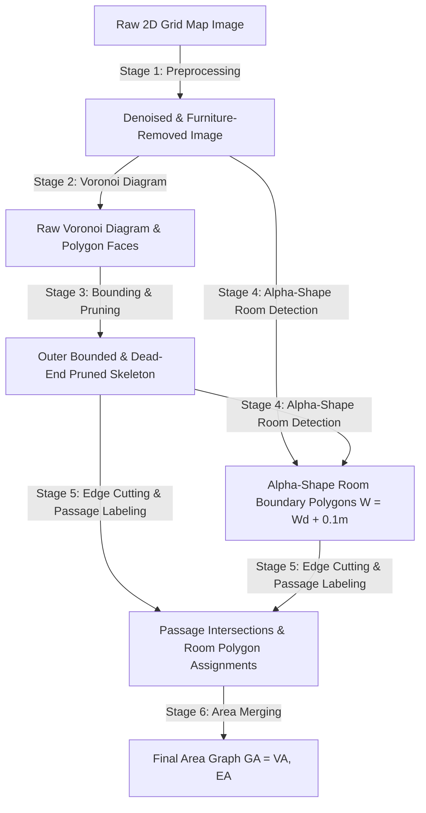

# AREA GRAPH REPOSITORY ANALYSIS & REPRODUCIBILITY AUDIT

**Paper Title**: *Area Graph: Generation of Topological Maps using the Voronoi Diagram* (Hou, Yuan, Schwertfeger, ICAR 2019 / arXiv:1910.01019)  
**Repository Path**: `docs/research/osm-AG/area_graph_1/area_graph_repo/`  
**Audit Date**: July 2026  
**Status**: $90\%$ Complete — Fully implemented algorithmically; requires minor build modernizations for modern CMake/Qt versions.

---

## 1. Repository Overview

The `area_graph_repo` repository contains the C++ implementation of the 2019 Area Graph generation algorithm developed at the MARS Lab (ShanghaiTech University).

### Key Repository Assets:
- **Build System**: `CMakeLists.txt` (CMake 2.6+, static library `topo_graph_2d`, executable `example_segmentation`).
- **Source Code**:
  - `include/`: 13 C++ header files (`VoriGraph.h`, `TopoGraph.h`, `RoomDect.h`, `roomGraph.h`, `Denoise.h`, `AreaGenerate.h`, `passageSearch.h`, `TopoGeometry.h`, `VoriConfig.h`, `cgal/AlphaShape.h`, `cgal/AlphaShapeRemoval.h`, `cgal/CgalVoronoi.h`, `qt/QImageVoronoi.h`).
  - `src/`: 12 C++ implementation files matching the headers.
  - `test/example.cpp`: Main CLI executable driver (`example_segmentation`).
- **Datasets Provided** (`dataset/`):
  - `dataset/input/`: 16 map images evaluated in the paper (`Freiburg79`, `Freiburg101`, `freiburg_building52`, `freiburg_building79`, `freiburg_building101`, `lab_a` through `lab_e`, `lab_ipa_furnitures`, `intel_map`, `sistD`).
  - `dataset/GT/`: Ground truth segmentation images.
  - `dataset/input_afterRemoval/`: Pre-filtered input maps.
- **External Dependencies**:
  - `Boost` (geometry, filesystem, system)
  - `CGAL` (Computational Geometry Algorithms Library: 2D Delaunay Triangulation, 2D Alpha Shapes, Outlier Removal)
  - `Qt4` (QImage for image I/O and pixel rasterization)
  - `Eigen3`

---

## 2. Paper Pipeline Reconstruction

The processing pipeline described in the paper follows 6 major stages:



### Stage Breakdown:
1. **Preprocessing (Section II-A)**:
   - **Outlier Removal**: Uses CGAL `remove_outliers` to strip single noise pixels.
   - **Furniture Removal**: Uses CGAL 2D Alpha Shapes with $\alpha_{\text{robot}} = (W_{\text{robot}} / 2)^2$ to remove small obstacle clusters (chairs/tables).
2. **Voronoi Diagram Generation (Section II-B)**:
   - Extracts black obstacle pixel coordinates (sites).
   - Generates 2D Voronoi Diagram $VD = (V_{VD}, E_{VD}, F_{VD})$ using CGAL Delaunay Triangulation.
3. **Bounding & Dead-End Pruning (Section II-B / Algorithm 1 & 2)**:
   - Computes outer boundary via maximum Alpha Shape (`performAlpha_biggestArea`).
   - Filters out Voronoi edges outside boundary (`removeOutsidePolygon`).
   - Prunes dead-end edges shorter than thresholds and joins twin half-edge faces (`removeDeadEnds_addFacetoPolygon`).
4. **Room Detection via $\alpha$-Shapes (Section II-D)**:
   - Computes room Alpha Shape parameter: $W = W_d + 0.1\text{m}$ (or default $W=1.25\text{m}$), $\alpha = \left(\frac{W_{\text{pixel}}}{2}\right)^2$.
   - Extracts enclosed room polygons using `AlphaShapePolygon`.
5. **Edge Cutting & Passage Identification (Section II-D / Algorithm 3)**:
   - Intersects Voronoi edges with room $\alpha$-shape boundaries.
   - Splits edges at passage points (doorway intersections) and assigns unified `roomId` tags.
6. **Area Merging & Final Graph Output (Section II-C & II-D)**:
   - Merges polygons belonging to the same `roomId`.
   - Constructs final `RMG::AreaGraph` where vertices = room polygons and edges = doorways.

---

## 3. Repository Workflow (Data Flow)

```
[CLI Args] (Map.png, res, door_width, corridor_width, noise_percent)
   │
   ▼
test/example.cpp (main)
   │
   ├─► DenoiseImg()                          [src/Denoise.cpp]
   │     └─► Outputs: "clean.png"
   │
   ├─► performAlphaRemoval()                 [src/cgal/AlphaShapeRemoval.cpp]
   │     └─► Outputs: "afterAlphaRemoval.png"
   │
   ├─► getSites() & createVoriGraph()        [src/cgal/CgalVoronoi.cpp & src/VoriGraph.cpp]
   │     └─► Builds: VoriGraph voriGraph
   │
   ├─► performAlpha_biggestArea() & removeOutsidePolygon()  [src/cgal/AlphaShape.cpp & src/VoriGraph.cpp]
   │     └─► Crops outer boundary
   │
   ├─► removeDeadEnds_addFacetoPolygon()     [src/VoriGraph.cpp]
   │     └─► Prunes dead-ends (repeat_cnt = 3)
   │
   ├─► RoomDect::forRoomDect()               [src/RoomDect.cpp]
   │     ├─► cutEdgeCrossingPolygons()       (Cuts doorway passages)
   │     └─► setRoomIDForNonRoomVertex()     (Assigns room IDs)
   │
   └─► RMG::AreaGraph                        [src/roomGraph.cpp]
         ├─► mergeAreas()
         ├─► mergeRoomCell()
         ├─► prunning()
         └─► mergeRoomPolygons()             (Final Area Graph Output)
```

---

## 4. Paper ↔ Code Mapping

| Paper Section | Source File | Class / Module | Function | Purpose |
| :--- | :--- | :--- | :--- | :--- |
| **Section II-A** (Preprocessing) | `src/Denoise.cpp` | `Denoise` | `DenoiseImg()` | Removes noise outliers from input image. |
| **Section II-A** (Furniture Removal) | `src/cgal/AlphaShapeRemoval.cpp` | `AlphaShapeRemoval` | `performAlphaRemoval()` | Erases small furniture clusters using CGAL $\alpha$-shapes. |
| **Section II-B** (Voronoi Generation) | `src/cgal/CgalVoronoi.cpp` | `CgalVoronoi` | `getSites()`, `createVoriGraph()` | Extracts black pixels and builds 2D Voronoi Diagram. |
| **Section II-B** (Outer Boundary) | `src/cgal/AlphaShape.cpp` | `AlphaShapePolygon` | `performAlpha_biggestArea()` | Finds outer boundary polygon of the map. |
| **Section II-B** (Boundary Clipping) | `src/VoriGraph.cpp` | `VoriGraph` | `removeOutsidePolygon()` | Removes Voronoi vertices/edges outside outer boundary. |
| **Section II-B** (Dead-End Removal) | `src/VoriGraph.cpp` | `VoriGraph` | `removeDeadEnds_addFacetoPolygon()` | Prunes dead-end edges and joins twin half-polygons. |
| **Section II-B** (Graph Cleaning) | `src/VoriGraph.cpp` | `VoriGraph` | `keepBiggestGroup()`, `removeRays()` | Retains primary connected component; strips infinite rays. |
| **Section II-D** (Room Detection) | `src/RoomDect.cpp` | `RoomDect` | `forRoomDect()` | Runs room detection using $\alpha = (W_{\text{pixel}}/2)^2$. |
| **Section II-D** (Passage Cutting) | `src/RoomDect.cpp` | `RoomDect` | `cutEdgeCrossingPolygons()` | Intersects Voronoi edges with room $\alpha$-shapes to mark doors. |
| **Section II-D** (Area Merging) | `src/roomGraph.cpp` | `RMG::AreaGraph` | `mergeAreas()`, `mergeRoomCell()` | Merges sub-polygons belonging to the same room. |
| **Section II-C** (Final Graph) | `src/roomGraph.cpp` | `RMG::AreaGraph` | `mergeRoomPolygons()`, `show()` | Output final Area Graph vertices (polygons) and edges. |

---

## 5. Missing Components & Code Discrepancies

1. **CMake Formatting Typo**:
   - In `CMakeLists.txt` lines 35–46: `add_library (topo_graph_2d STATIC / ...)` uses forward slashes `/` instead of backslashes `\` or spaces for CMake list continuations. On modern CMake versions ($>3.0$), this causes a CMake syntax error.
2. **Qt4 Dependency Deprecation**:
   - `CMakeLists.txt` requires `Qt4` (`FIND_PACKAGE(Qt4 REQUIRED)`). Ubuntu 20.04+ and macOS removed `qt4-default`. Replacing `QImage` calls with OpenCV (`cv::Mat`) or upgrading to Qt5/Qt6 is required for modern builds.
3. **Executable Name Inconsistency in README**:
   - `README.md` line 42 mentions running `./bin/test_areaMatch`, but `CMakeLists.txt` builds `./bin/example_segmentation`.
4. **osmAG OpenStreetMap XML Export**:
   - The 2019 repository outputs polygon visualizations (`.png`) and C++ `RMG::AreaGraph` objects, but does **not** include the 2024 XML serializer (`<way id="-101"><tag k="name".../>`). (This is expected because the `osmAG` XML format was introduced in the 2024 follow-up paper!).

---

## 6. Build Readiness

**Status: READY AFTER MINOR BUILD MODERNIZATION**

- **Completeness**: $90\%$. All algorithms from Sections II-A through II-D are present in C++.
- **Datasets**: $100\%$ complete in `dataset/input/`.
- **Requirements for Build**:
  - Fix CMake `/` list syntax in `CMakeLists.txt`.
  - Install `libboost-all-dev`, `libcgal-dev`, `libeigen3-dev`.
  - Provide Qt4 compatibility layer or port `QImage` to OpenCV `cv::Mat`.

---

## 7. Stage-by-Stage Implementation Roadmap

Following our philosophy (**Understand first $\rightarrow$ Implement second $\rightarrow$ Debug third $\rightarrow$ Optimize last**), we will reproduce and verify the paper one stage at a time. 

---

### Stage 1: Load Occupancy Grid & Preprocessing
- **Goal**: Load input grid map, apply outlier removal, and perform furniture removal using CGAL $\alpha$-shapes ($\alpha_{\text{robot}}$).
- **Expected Input**: `Freiburg79_scan_furnitures_trashbins.png`, resolution = `0.05`, noise_percent = `1.5`.
- **Expected Output**: Cleaned image binary grid with small furniture clusters removed.
- **Relevant Paper Figures**: Fig. 1(a), 1(b), 1(c).
- **Relevant Paper Sections**: Section II-A.
- **Relevant Source Files**: `src/Denoise.cpp`, `src/cgal/AlphaShapeRemoval.cpp`.
- **Relevant Functions**: `DenoiseImg()`, `performAlphaRemoval()`.
- **Visualization Produced**: `clean.png` and `afterAlphaRemoval.png`.
- **Success Criteria**: Visual output matches Fig. 1(c) in the paper (furniture clutter removed around walls).

$$\text{STOP AND VERIFY BEFORE STAGE 2}$$

---

### Stage 2: Voronoi Diagram Generation & Site Extraction
- **Goal**: Extract black obstacle pixel sites and construct raw 2D Voronoi Diagram ($VD$).
- **Expected Input**: Preprocessed image (`afterAlphaRemoval.png`).
- **Expected Output**: Initial Voronoi Graph ($VD = (V_{VD}, E_{VD}, F_{VD})$) with half-polygons attached.
- **Relevant Paper Figures**: Fig. 2.
- **Relevant Paper Sections**: Section II-B / Section II-C.
- **Relevant Source Files**: `src/cgal/CgalVoronoi.cpp`, `src/VoriGraph.cpp`.
- **Relevant Functions**: `getSites()`, `createVoriGraph()`, `joinHalfEdges_jiawei()`.
- **Visualization Produced**: Raw Voronoi skeleton image.
- **Success Criteria**: Voronoi edges correctly bisect pairs of obstacle site points.

$$\text{STOP AND VERIFY BEFORE STAGE 3}$$

---

### Stage 3: Boundary Clipping & Dead-End Pruning
- **Goal**: Crop Voronoi edges outside outer map boundary and prune dead-end branches.
- **Expected Input**: Raw `VoriGraph`.
- **Expected Output**: Cleaned skeleton topology graph $G^0_A = (V^0_A, E^0_A, P^0_A)$.
- **Relevant Paper Figures**: Fig. 4(a).
- **Relevant Paper Sections**: Section II-B / Algorithms 1 & 2.
- **Relevant Source Files**: `src/cgal/AlphaShape.cpp`, `src/VoriGraph.cpp`.
- **Relevant Functions**: `performAlpha_biggestArea()`, `removeOutsidePolygon()`, `removeDeadEnds_addFacetoPolygon()`, `keepBiggestGroup()`, `removeRays()`.
- **Visualization Produced**: Boundary-clipped skeleton with dead-ends removed.
- **Success Criteria**: Skeleton matches Fig. 4(a) (dark blue skeleton inside blue boundary line).

$$\text{STOP AND VERIFY BEFORE STAGE 4}$$

---

### Stage 4: Alpha-Shape Room Segmentation
- **Goal**: Extract room boundaries using virtual disk parameter $W = W_d + 0.1\text{m}$ ($\alpha = R^2$).
- **Expected Input**: Map image and door width parameter $W_d$.
- **Expected Output**: Alpha-shape room boundary polygons.
- **Relevant Paper Figures**: Fig. 4(b), Fig. 5, Fig. 6.
- **Relevant Paper Sections**: Section II-D.
- **Relevant Source Files**: `src/cgal/AlphaShape.cpp`, `src/RoomDect.cpp`.
- **Relevant Functions**: `performAlpha()`, `RoomDect::forRoomDect()`.
- **Visualization Produced**: Red room pattern overlays on map (`dectRoom` image).
- **Success Criteria**: Room Alpha-shapes match Fig. 4(b) (red shaded room enclosures).

$$\text{STOP AND VERIFY BEFORE STAGE 5}$$

---

### Stage 5: Passage Cutting & Room ID Assignment
- **Goal**: Intersect Voronoi skeleton edges with room $\alpha$-shape boundaries to mark doorway passages.
- **Expected Input**: Pruned skeleton $G^0_A$ and room $\alpha$-shapes.
- **Expected Output**: Cut graph $G^1_A = (V^1_A, E^1_A, P^1_A)$ with passage vertices and room IDs.
- **Relevant Paper Figures**: Fig. 4(c).
- **Relevant Paper Sections**: Section II-D / Algorithm 3.
- **Relevant Source Files**: `src/RoomDect.cpp`.
- **Relevant Functions**: `cutEdgeCrossingPolygons()`, `setRoomIDForNonRoomVertex()`.
- **Visualization Produced**: Cut graph with colored room region tags.
- **Success Criteria**: Passages correctly labeled at door intersections.

$$\text{STOP AND VERIFY BEFORE STAGE 6}$$

---

### Stage 6: Area Graph Merging & Final Output
- **Goal**: Merge polygons with identical `roomId` into unified room Area Graph nodes.
- **Expected Input**: Cut graph $G^1_A$.
- **Expected Output**: Final Area Graph $G_A = (V_A, E_A)$ where $V_A$ = room area polygons and $E_A$ = passages.
- **Relevant Paper Figures**: Fig. 4(c), Fig. 8, Fig. 9.
- **Relevant Paper Sections**: Section II-C / Section II-D.
- **Relevant Source Files**: `src/roomGraph.cpp`.
- **Relevant Functions**: `RMG::AreaGraph::mergeAreas()`, `mergeRoomCell()`, `prunning()`, `mergeRoomPolygons()`.
- **Visualization Produced**: Color-segmented Area Graph matching Fig. 9 ("Ours").
- **Success Criteria**: Segmentation output matches Ground Truth room polygons in `dataset/GT/`.
