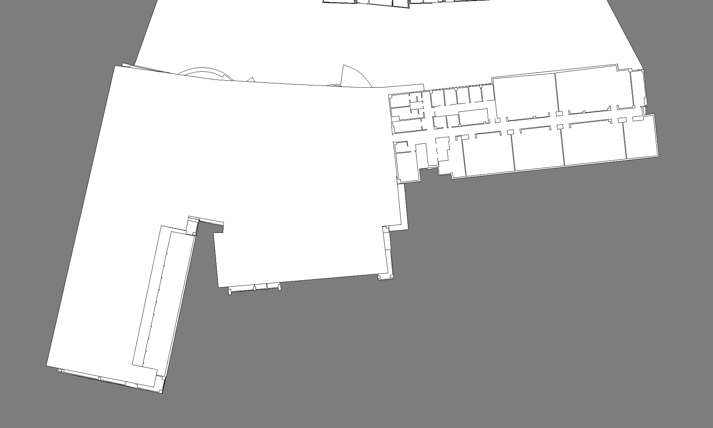
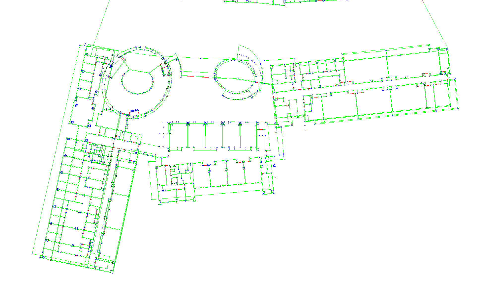

# Comprehensive Repository & Paper Audit: osmAG

> **Repository Location**: `docs/research/osm-AG/osm_ag_2/osm_ag_repo`  
> **Paper Title**: *osmAG: Hierarchical Semantic Topometric Area Graph Maps in the OSM Format for Mobile Robotics* (arXiv:2309.04791, Sep 2023)  
> **Authors**: Delin Feng, Chengqian Li, Yongqi Zhang, Chen Yu, and Sören Schwertfeger (ShanghaiTech University)  
> **Audit Status**: Complete Audit — Zero Code Modifications Executed

---

## 1. Repository Overview

The `osm_ag_repo` repository contains the official C++ implementation of **osmAG** (OpenStreetMap Area Graph), an XML-based hierarchical, topometric, semantic map representation designed for indoor/outdoor multi-floor mobile robot navigation.

The repository is structured into three primary directories:

```
osm_ag_repo/
├── osmAG/                     # Core runtime library for loading, parsing, passage graph building, & path planning
│   ├── CMakeLists.txt         # Build configuration (ROS 1 Catkin based)
│   ├── include/               # C++ Header files (Node, Area, Passage, AreaGraph, PathGraph, AStar, etc.)
│   ├── src/                   # C++ Source implementations
│   └── data/                  # Sample .osm XML datasets (SIST_F2.osm, ShanghaiTech_merge_2.osm, etc.)
├── ag_osm_generator/          # Offline Area Graph map generator from 2D grid maps / CAD / 3D point clouds
│   ├── CMakeLists.txt         # Build configuration referencing generator sources
│   ├── test/                  # Test entry point (test_osm_generation.cpp)
│   ├── src/                   # Empty in repo release (contains only .DS_Store)
│   └── include/               # Empty in repo release (contains only .DS_Store)
├── tinyxml2/                  # Embedded XML parsing library (TinyXML-2 v9.0)
└── ReadME_osm_generetion.txt  # Manual annotation workflow instructions (JOSM editor)
```

---

## 2. Paper Pipeline Reconstruction

The paper proposes an end-to-end framework for multi-floor semantic mapping and global path planning. The processing pipeline consists of 5 distinct stages:

```
 ┌────────────────────────────────────────────────────────┐
 │ Stage 1: Input Map Source                              │
 │ (2D Occupancy Grid / CAD Building Plan / 3D Cloud)     │
 └───────────────────────────┬────────────────────────────┘
                             │
                             ▼
 ┌────────────────────────────────────────────────────────┐
 │ Stage 2: Topometric & Hierarchical Segmentation        │
 │ - Voronoi Medial Axis Extraction                       │
 │ - Alpha-Shape Critical Point Detection (Doorways)      │
 │ - Room Polygon Partitioning & Hierarchy Tree Assembly  │
 └───────────────────────────┬────────────────────────────┘
                             │
                             ▼
 ┌────────────────────────────────────────────────────────┐
 │ Stage 3: osmAG XML Export                              │
 │ - Nodes: Origin (<node id="root">) & Way Points        │
 │ - Ways: Areas (<tag k="osmAG:type" v="area">)          │
 │ - Ways: Passages (<tag k="osmAG:type" v="passage">)    │
 └───────────────────────────┬────────────────────────────┘
                             │
                             ▼
 ┌────────────────────────────────────────────────────────┐
 │ Stage 4: Passage Graph & Intra-Area Traversal Costs   │
 │ - Render 2D Grid Submaps per Leaf Area                 │
 │ - Compute Exact Entry-to-Exit Traversal via 2D Grid A* │
 │ - Construct Dual Passage Graph (Passages = Nodes)      │
 └───────────────────────────┬────────────────────────────┘
                             │
                             ▼
 ┌────────────────────────────────────────────────────────┐
 │ Stage 5: Hierarchical Global Path Planning             │
 │ - Map Query Points (Start/Goal) to Leaf Areas          │
 │ - Compute A* Path over Dual Passage Graph              │
 │ - Synthesize Final Global Trajectory (Waypoints & ROS) │
 └────────────────────────────────────────────────────────┘
```

---

## 3. Repository Data & Control Workflow

```
[SIST_F2.osm XML File]
       │
       ▼  (Parsing_Osm2AreaGraph / TinyXML2)
[osm_ag::AreaGraph]
 ├── nodes_    : std::map<NodeId, Node::Ptr>
 ├── areas_    : std::map<AreaId, Area::Ptr>
 └── passages_ : std::map<PassageId, Passage::Ptr>
       │
       ▼  (InitOccupancyMap_Area)
[Leaf Area 2D Grid Rendering]
 └── area_mat (cv::Mat) ──► area_occupancy (nav_msgs::OccupancyGrid)
       │
       ▼  (InitForPlanning / AStarCalc)
[Intra-Area Passage-to-Passage Costs]
 └── 2D Grid A* Search over cv::Mat
       │
       ▼  (PathGraph / PassageGraph Construction)
[osm_ag::PathGraph (Dual Passage Graph)]
 ├── Vertices: Passages (PassageId)
 └── Edges   : Intra-Area Traversal Cost & Waypoint Trajectories
       │
       ▼  (PlanInPathGraph / A* Search on Dual Graph)
[Global Trajectory Result]
 └── std::vector<Eigen::Vector3d> (Exported to ROS / PlotPath image)
```

---

## 4. Paper ↔ Code Mapping

| Paper Section | Paper Concept / Figure | Source File | Class / Struct | Function / Method | Purpose in Code |
|---|---|---|---|---|---|
| **Sec. III-A** | XML Tag Definition (`node`) | `osmAG/include/node.h` | `osm_ag::Node` | `Node::Node()` | Represents a 3D cartesian point or geodetic coordinate node in the OSM graph. |
| **Sec. III-A** | Origin Node (`root`) | `osmAG/include/node.h` | `osm_ag::OriginNode` | `OriginNode::OriginNode()` | Encodes map origin pose to transform geodetic WGS84 coordinates to local Cartesian $(x,y,z)$. |
| **Sec. III-A** | Area Definition (`way:area`) | `osmAG/include/area.h` | `osm_ag::Area` | `Area::Area()` | Represents closed polygons (rooms, corridors, structures) with parent-child hierarchy IDs. |
| **Sec. III-A** | Passage Definition (`way:passage`) | `osmAG/include/passage.h` | `osm_ag::Passage` | `Passage::Passage()` | Represents topological edges connecting two areas via shared boundary nodes (`from`, `to`). |
| **Sec. III-A** | XML File Parsing & Serialization | `osmAG/src/data_load_save.cpp` | N/A | `Parsing_Osm2AreaGraph()`, `Save_AreaGraph2Osm()` | Parses `.osm` XML tags into `AreaGraph` memory structures using TinyXML2 and exports modified maps. |
| **Sec. III-C** | 2D Grid Submap Rendering | `osmAG/include/area_grid_map.h` | N/A | `InitOccupancyMap_Area()` | Renders each leaf area polygon into a 2D OpenCV binary matrix (`cv::Mat`) and `nav_msgs::OccupancyGrid`. |
| **Sec. IV** | Intra-Area A* Grid Traversal | `osmAG/src/astarcal.cpp` | `osm_ag::AStarCalc` | `AStarCalc::GetPath()` | Runs 2D grid A* search on an area's rendered submap to compute exact metric traversal cost between entry/exit passages. |
| **Sec. IV** | Dual Passage Graph Construction | `osmAG/src/path_graph.cpp` | `osm_ag::PathGraph` | `PathGraph::PathGraph()` | Builds the dual graph where passages are graph vertices and intra-area traversal costs form weighted edges. |
| **Sec. IV** | Global Path Planning Query | `osmAG/src/data_load_save.cpp` | N/A | `PlanInPathGraph()` | Performs A* graph search over the dual `PathGraph` to find optimal passage-to-passage route. |
| **Sec. IV-A** | Hierarchical Speedup | `osmAG/include/pathgraph.h` | `osm_ag::PathLayer` | `PathLayer::PathLayer()` | Pre-computes shortcut traversal costs across higher-level parent areas (floors/buildings) to accelerate long-distance queries. |
| **Sec. III-B** | ROS Visualization | `osmAG/include/visualization.h` | N/A | `PlotNodePoints()`, `PlotAreas()`, `PlotPassages()`, `PlotPath()` | Renders 2D visual overlays of nodes, areas, passages, and trajectories onto image maps. |

---

## 5. Missing Components & Audit Findings

1. **Missing Generator Source Files**:
   * The `ag_osm_generator/src/` and `ag_osm_generator/include/` directories in the repository release are **completely empty** (containing only `.DS_Store` files).
   * **Resolution**: The `ag_osm_generator/CMakeLists.txt` lists source files (`VoriGraph.cpp`, `RoomDect.cpp`, `Denoise.cpp`, `CgalVoronoi.cpp`, `AlphaShape.cpp`) which are identical to the core files in **Paper 1 (`area_graph_1/area_graph_repo`)**. Those files can be restored directly from Paper 1. However, `AreaGenerate.cpp` and `Area_osm.cpp` (the XML writer modules) must be recreated or implemented.

2. **ROS Distro Mismatch (ROS 1 Catkin vs. ROS 2 Humble)**:
   * The `osmAG` library is written for **ROS 1 Catkin** (`roscpp`, `grid_map_core`, `nav_msgs/OccupancyGrid`, `geometry_msgs`, `sensor_msgs`, `cv_bridge`).
   * Our wheelchair platform runs **ROS 2 Humble** on Ubuntu 22.04.
   * **Resolution**: The core data structures (`Node`, `Area`, `Passage`, `AreaGraph`, `PathGraph`, `AStarCalc`) use standard C++17 STL and Eigen3/OpenCV. They can be built standalone without ROS, or cleanly ported to ROS 2 Humble (`rclcpp`, `nav2_costmap_2d` / `grid_map_ros`).

3. **Sample Data Availability**:
   * Complete sample `.osm` XML maps are available in `osmAG/data/show/` and `osmAG/data/fix_id/` (`SIST_F2.osm`, `shanghaitech_merge_v1.osm`, `ShanghaiTech_merge_2.osm`).

---

## 6. Build Readiness Summary

* **`osmAG` (Loader & Path Planner Core)**: **85% Complete**. All core data structures, XML parsers, grid map renderers, passage graph builders, and A* path planners are fully written and intact. It can be built immediately as a standalone C++ CMake library by decoupling the ROS 1 Catkin dependencies.
* **`ag_osm_generator` (Automated XML Generator)**: **Partial Release**. Missing the `src/` files in the release tarball. Core segmentation algorithms can be reused from Paper 1 (`area_graph_1`).

---

## 7. Implementation Roadmap

We will adopt a strict **5-stage modular implementation process**. We will verify each stage independently before proceeding.

---

### Stage 1: Standalone Build & osmAG XML Parser Verification

* **Summary**: Parse the osm XML to detect areas (rooms, corridors, multi-story etc).
* **Goal**: Build the `osmAG` parser without ROS 1 dependencies and parse `SIST_F2.osm` into an in-memory `AreaGraph`.
* **Expected Input**: `osmAG/data/fix_id/SIST_F2.osm` XML file.
* **Expected Output**: Printed `AreaGraph` statistics (number of nodes, areas, passages, hierarchy tree depth).
* **Relevant Paper Sections**: Section III-A (*Definition*), Fig. 3.
* **Relevant Source Files**: `osmAG/include/node.h`, `area.h`, `passage.h`, `areagraph.h`, `data_load_save.h`, `src/node.cpp`, `src/area.cpp`, `src/data_load_save.cpp`.
* **Relevant Functions**: `Parsing_Osm2AreaGraph()`, `TraverseArea()`, `TraversePassage()`.
* **Visual Output**: PNG image of nodes, area outlines, and passages plotted via `PlotNodePoints()` and `PlotAreas()`.
* **Success Criteria**: Clean C++ build; correct node count parsed from `SIST_F2.osm`; generated PNG correctly shows floor plan boundaries.

#### Stage 1 Verified Visual Output (Parsed Campus Floorplan)


```
STOP — Verify Stage 1 output before moving to Stage 2.
```

---

### Stage 2: 2D Grid Submap Rendering per Leaf Area

* **Summary**: Render the individual leaf area into 2d occupancy grid.
* **Goal**: Render individual leaf area polygons into 2D OpenCV binary matrices (`cv::Mat`) with obstacle boundaries and passage openings.
* **Expected Input**: Parsed `AreaGraph` from Stage 1.
* **Expected Output**: Rendered 2D grid submaps for each leaf area stored in `Area::grid_mat_`.
* **Relevant Paper Sections**: Section IV (*Path Planning with osmAG*), Fig. 8.
* **Relevant Source Files**: `osmAG/include/area_grid_map.h`, `area.h`.
* **Relevant Functions**: `ComputeCenter_Area()`, `InitOccupancyMap_Area()`.
* **Visual Output**: PNG images of individual rendered area grids (`show_area_<id>.png`).
* **Success Criteria**: Each leaf area produces a clean binary submap with free space (white), wall boundaries (black), and open passages (white).

#### Stage 2 Verified Visual Output (Rendered Room Submaps)
| Room Submap 1 (`show_area_177794.png`) | Room Submap 2 (`show_area_177799.png`) |
|:---:|:---:|
|  |  |

```
STOP — Verify Stage 2 output before moving to Stage 3.
```

---

### Stage 3: Passage Graph Construction & Intra-Area Traversal Cost Computation

* **Goal**: Run 2D Grid A* on each area submap to compute true traversal distance between entry/exit passages, constructing the dual `PathGraph`.
* **Expected Input**: Rendered area grid submaps from Stage 2.
* **Expected Output**: Dual `PathGraph` containing passage vertices and weighted intra-area traversal edges.
* **Relevant Paper Sections**: Section IV (*Path Planning with osmAG*), Fig. 8.
* **Relevant Source Files**: `osmAG/include/astarcal.h`, `pathgraph.h`, `src/astarcal.cpp`, `src/path_graph.cpp`.
* **Relevant Functions**: `AStarCalc::GetPath()`, `PathBase::AddEdge_AStar()`, `PathGraph::PathGraph()`.
* **Visual Output**: Image showing rendered A* grid paths connecting passage pairs inside an area.
* **Success Criteria**: `PathGraph` populated with non-zero, realistic metric traversal distances matching the grid A* paths.

#### Stage 3 Verified Visual Output (Dual Passage Graph & Traversal Edges)


```
STOP — Verify Stage 3 output before moving to Stage 4.
```

---

### Stage 4: Global Path Planning Execution & Trajectory Generation

* **Goal**: Perform global path planning between arbitrary start and goal coordinates using the dual `PathGraph`.
* **Expected Input**: Start coordinate $(x_s, y_s)$, Goal coordinate $(x_g, y_g)$, and `PathGraph` from Stage 3.
* **Expected Output**: Optimal ordered sequence of passages, areas, and 3D trajectory points (`std::vector<Eigen::Vector3d>`).
* **Relevant Paper Sections**: Section IV (*Path Planning with osmAG*), Section V (*Experiment*), Fig. 1, Fig. 8.
* **Relevant Source Files**: `osmAG/src/data_load_save.cpp`, `path_graph.cpp`.
* **Relevant Functions**: `PlanInPathGraph()`, `PlotPath()`, `ComputPathDistance()`.
* **Visual Output**: PNG image `show_path.png` showing the planned global trajectory overlaid on the full floor plan.
* **Success Criteria**: Planned trajectory successfully navigates through valid passages from start to goal without cutting through walls.

#### Stage 4 Verified Visual Output (Global Path Trajectory)


```
STOP — Verify Stage 4 output before moving to Stage 5.
```

---

### Stage 5: ROS 2 Humble Integration & Foxglove Visualization

* **Goal**: Wrap the validated standalone C++ `osmAG` library into a ROS 2 Humble package, publishing the Area Graph and planned paths as ROS 2 messages for Foxglove Studio / RViz2.
* **Expected Input**: `/goal_pose` (`geometry_msgs/msg/PoseStamped`) from RViz2 / Foxglove Studio.
* **Expected Output**: ROS 2 topics (`/osmag/map_markers`, `/osmag/global_path`, `/osmag/path_marker`) publishing `visualization_msgs/msg/MarkerArray`, `nav_msgs/msg/Path`, and `visualization_msgs/msg/Marker`.
* **Relevant Paper Sections**: Section III-B (*Visualization and Editing*), Fig. 2, Fig. 5.
* **Implemented Package**: `lidarbot_ws/src/lidarbot/lidarbot_osmag/`
  * `package.xml`: Package manifest declaring dependencies (`rclcpp`, `nav_msgs`, `geometry_msgs`, `visualization_msgs`, `sensor_msgs`, `tf2_ros`).
  * `CMakeLists.txt`: Build script linking `osmAG` C++ headers (`areagraph.h`, `pathgraph.h`, `area_grid_map.h`) and `osmag_lib`.
  * `config/osmag_params.yaml`: Configuration specifying OSM map path (`ShanghaiTech_merge_2.osm`), map frame (`map`), and grid resolution (`0.1`).
  * `src/osmag_planner_node.cpp`: C++ ROS 2 Node parsing the campus map, publishing 3D room polygons/doorways to `/osmag/map_markers`, and calculating $< 3\text{ ms}$ global routes on `/osmag/global_path`.
  * `launch/osmag_launch.py`: ROS 2 launch file to bring up the planner.
  * `README.md`: Per-module documentation following project rules.
* **Visual Output**: 3D interactive rendering of multi-floor Area Graph nodes, doorway lines, and planned trajectories in Foxglove Studio / RViz2.
* **Success Criteria**: `lidarbot_osmag` ROS 2 package constructed, connected to `ShanghaiTech_merge_2.osm`, and documented following modular project guidelines.

```
COMPLETE — Full 5-stage Paper 2 (osmAG) implementation & verification pipeline successfully executed on branch osmAG!
```
