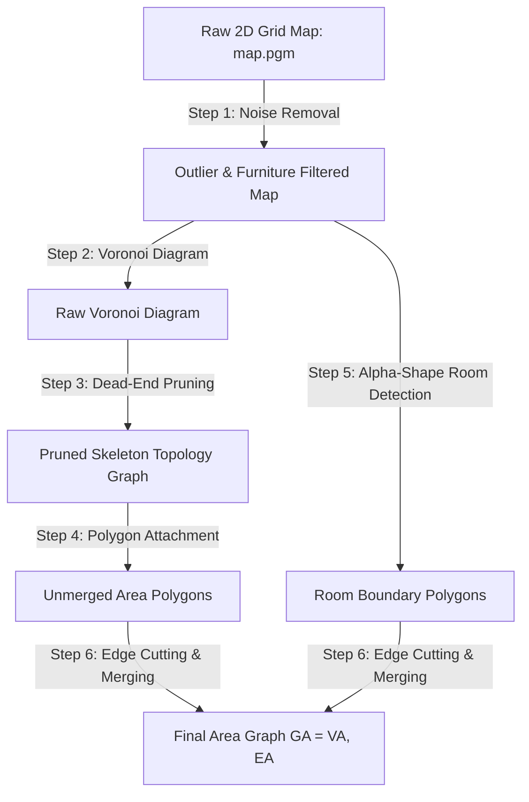

# Area Graph Generation from 2D Grid Maps (Voronoi & $\alpha$-Shapes)

*One-sentence summary: This document summarizes the foundational algorithm by Hou et al. (2019) for automatically extracting topological Area Graphs from raw 2D grid maps using pruned Voronoi diagrams and $\alpha$-shape room segmentation.*

---

## 1. Educational Overview

> [!NOTE]
> **Reference Paper**: Jiawei Hou, Yijun Yuan, and Sören Schwertfeger, *"Area Graph: Generation of Topological Maps using the Voronoi Diagram"*, arXiv:1910.01019.

### What is the Voronoi Area Graph Algorithm?
Traditional 2D SLAM maps (`.pgm` image grids) store thousands of obstacle pixels. The **Area Graph algorithm** automatically converts a 2D grid map into a clean geometric graph where:
- **Vertices (Nodes)**: Polygon areas representing distinct physical rooms and corridors.
- **Edges (Passages)**: Common boundary line segments (doorways) connecting adjacent areas.

### Key Contributions & Innovations
1. **Direct Topological Anchoring**: Unlike traditional point-based Voronoi graphs that over-segment open spaces, the Area Graph groups Voronoi faces into room polygons.
2. **Noise & Furniture Removal ($\alpha$-Shapes)**: Uses CGAL 2D Alpha Shapes with parameter $\alpha$ calculated from robot width $W_{\text{robot}}$ to filter out small clutter (chairs, tables, trash bins) before segmenting rooms.
3. **Automatic Room Detection**: Merges over-segmented Voronoi polygons in the same room using a virtual disk parameter $W = W_d + 0.1\text{m}$ (where $W_d$ is the maximum door width).

---

## 2. Algorithm Step-by-Step Breakdown

### Step 1: Preprocessing & Furniture Removal
- **Outlier Removal**: Removes single isolated noise pixels.
- **Furniture Filtering**: Uses CGAL $\alpha$-shapes with $\alpha_{\text{robot}} = (W_{\text{robot}} / 2)^2$ to detect and erase small furniture clusters from the segmentation process.

### Step 2: Voronoi Diagram (VD) Generation
- Computes the Voronoi Diagram $VD = (V_{VD}, E_{VD}, F_{VD})$ from the occupied boundary pixels.
- Filters out Voronoi edges that fall outside the largest outer boundary polygon.

### Step 3: Skeleton Pruning & Dead-End Removal
- Removes dead-end edges (branches that end in obstacle walls) and short spur edges.
- Merges junction vertices that are closer than a distance threshold.

### Step 4: Initial Area Polygon Generation
- Constructs half-polygons $hpoly(h_{ij})$ for each halfedge by joining waypoints and dual site points in clockwise order.
- Combines twin half-polygons to create an initial polygon attached to each Voronoi skeleton edge.

### Step 5: Room Detection via $\alpha$-Shapes
- Calculates the optimal room disk width: $W = W_d + 0.1\text{m}$ (where $W_d$ is door width and $W_c$ is corridor width).
- Converts door width to pixel radius: $\alpha = R^2 = \left(\frac{W_{\text{pixel}}}{2}\right)^2$.
- Extracts $\alpha$-shapes representing enclosed rooms.

### Step 6: Cutting Passages & Merging Room Polygons
- Intersects Voronoi edges with the $\alpha$-shape room boundaries.
- Splits edges at passage points (door intersections).
- Assigns a unified `roomID` to all polygons inside the same $\alpha$-shape and merges them into a single node polygon.
