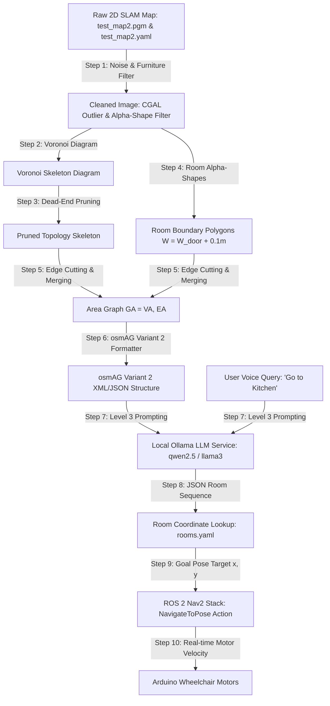

# osmAG LLM Path Planning: Complete Implementation Plan

*One-sentence summary: This document establishes the detailed architecture, algorithmic pipeline, ROS 2 package layout, prompt templates, and execution steps for transforming raw 2D SLAM maps into Voronoi Area Graphs (Hou et al. 2019), formatting them into osmAG text representations (Xie et al. 2024), and driving our autonomous wheelchair using local LLM reasoning.*

---

## 1. Educational Overview

> [!NOTE]
> **Reference Papers**:
> 1. **Topological Area Graph Generation**: Jiawei Hou, Yijun Yuan, & Sören Schwertfeger, *"Area Graph: Generation of Topological Maps using the Voronoi Diagram"*, arXiv:1910.01019. Local summary: [area-graph-generation-paper.md](file:///Users/teamincredibles/Desktop/Setups/Downloads/Semantic-Autonomous-Wheelchair/docs/research/osmag-llm-path-planning/area-graph-generation-paper.md).
> 2. **osmAG LLM Comprehension**: Fujing Xie & Sören Schwertfeger, *"Empowering Robot Path Planning with Large Language Models: osmAG Map Topology & Hierarchy Comprehension with LLMs"*, IEEE ROBIO 2024. Local PDF: [2403.08228v3.pdf](file:///Users/teamincredibles/Desktop/Setups/Downloads/Semantic-Autonomous-Wheelchair/docs/research/osmag-llm-path-planning/2403.08228v3.pdf).

### What is the Full Pipeline?
This implementation plan unites two breakthrough research papers into a single pipeline:
- **Phase A (Hou et al. 2019)**: Takes our 2D SLAM grid map (`test_map2.pgm` / `Terrace.pgm`) and automatically segments it into room polygons and door passages using Voronoi diagrams and $\alpha$-shapes.
- **Phase B (Xie et al. 2024)**: Formats these extracted room polygons into **osmAG Variant 2 XML/JSON text**, passes them to a local LLM (Ollama), and computes room-to-room navigation paths.
- **Phase C (ROS 2 Nav2)**: Converts the target room node into coordinates $(x, y, \theta)$ and dispatches them to ROS 2 Nav2 for dynamic obstacle avoidance.

---

## 2. End-to-End Step-by-Step Algorithmic Pipeline

The diagram below details every step from raw 2D grid map input to motor actuation:



---

## 3. Detailed Algorithmic Step Breakdown

### Step 1: Preprocessing & Furniture Removal (Hou et al. 2019)
1. **Outlier Removal**: Apply CGAL outlier removal to strip single noise pixels.
2. **Furniture Removal ($\alpha_{\text{robot}}$)**: Compute $\alpha_{\text{robot}} = (W_{\text{robot}} / 2)^2$ where $W_{\text{robot}}$ is the width of our wheelchair ($0.45\text{m}$). Erase small internal furniture clusters (chair legs, trash bins) from the image grid.

### Step 2: Voronoi Diagram (VD) Skeletonization
1. Compute 2D Voronoi Diagram from occupied wall pixels using OpenCV distance transform / CGAL.
2. Filter out Voronoi edges extending outside the map's outer boundary.

### Step 3: Dead-End Pruning & Skeleton Clean-Up
1. Remove dead-end edges (branches ending in obstacle walls) shorter than threshold $T_{\text{deadend}}$.
2. Merge adjacent junction vertices closer than $0.2\text{m}$.

### Step 4: Alpha-Shape Room Segmentation
1. Define room disk width $W = W_d + 0.1\text{m}$ (where $W_d \approx 0.75\text{m}$ is standard door width).
2. Convert width to pixel radius: $\alpha = R^2 = \left(\frac{W_{\text{pixel}}}{2}\right)^2$.
3. Compute CGAL 2D Alpha Shapes to extract closed room polygons.

### Step 5: Passage Cutting & Area Polygon Merging
1. Intersect Voronoi skeleton edges with $\alpha$-shape room boundaries.
2. Mark intersection points as **Passages (Doorways)**.
3. Assign a single `roomID` to all Voronoi faces inside the same $\alpha$-shape and merge them into a single **Area Graph Node**.

### Step 6: Formatting into osmAG Variant 2 (Xie et al. 2024)
Convert the extracted Area Graph nodes and passages into **osmAG Variant 2 XML/JSON**, embedding direct connection tags inside room element tags:

```xml
<osm version="0.6" generator="Lidarbot_osmAG">
  <way id="-101">
    <tag k="name" v="Living_Room" />
    <tag k="osmAG:areaType" v="room" />
    <tag k="osmAG:type" v="area" />
    <tag k="Living_Room_directly_connected_room" v="Corridor" />
  </way>
  <way id="-102">
    <tag k="name" v="Corridor" />
    <tag k="osmAG:areaType" v="corridor" />
    <tag k="osmAG:type" v="area" />
    <tag k="Corridor_directly_connected_room" v="Living_Room" />
    <tag k="Corridor_directly_connected_room" v="Kitchen" />
  </way>
  <way id="-103">
    <tag k="name" v="Kitchen" />
    <tag k="osmAG:areaType" v="room" />
    <tag k="osmAG:type" v="area" />
    <tag k="Kitchen_directly_connected_room" v="Corridor" />
  </way>
</osm>
```

### Step 7: Level 3 LLM Prompt Engineering & Inference
Send the `osmAG` XML topology and user query to Ollama (`http://localhost:11434/api/generate`) using Level 3 in-context prompt structure:

```text
TASK: You are a wheelchair navigation assistant. Given the osmAG map topology below, find the shortest room-by-room sequence from start room to destination room. Output ONLY a valid JSON array of room names.

EXAMPLE:
Map: Room A connected to Hallway. Hallway connected to Room B.
Query: Go from Room A to Room B.
Output: ["Room A", "Hallway", "Room B"]

MAP TOPOLOGY:
<osmAG XML content here>

QUERY: Go from Living_Room to Kitchen.
OUTPUT:
```

### Step 8: Parsing LLM Output & Goal Pose Dispatch
1. Parse LLM JSON output: `["Living_Room", "Corridor", "Kitchen"]`.
2. Retrieve target room center $(x, y, \theta)$ from `config/rooms.yaml`.
3. Dispatch Action Goal `NavigateToPose` to ROS 2 Nav2 stack.
4. Nav2 drives the wheelchair to the room target with real-time RPLidar obstacle avoidance!

---

## 4. ROS 2 Package Layout (`lidarbot_llm`)

```
lidarbot_ws/src/lidarbot/lidarbot_llm/
├── CMakeLists.txt / setup.py
├── package.xml
├── README.md
├── config/
│   ├── llm_params.yaml                 # Ollama URL, model name, prompt level
│   └── rooms.yaml                      # Room center (x,y,theta) pose lookup
├── launch/
│   └── llm_navigation.launch.py        # Launches converter & LLM planner node
└── script/
    ├── grid_to_osmag.py                # Voronoi & Alpha-Shape Area Graph Generator
    └── osmag_llm_planner.py            # Ollama REST Client & Nav2 Action Dispatcher
```

---

## 5. Summary Checklist for Execution

- [ ] Create package `lidarbot_llm` inside `lidarbot_ws/src/lidarbot/`.
- [ ] Implement `grid_to_osmag.py` using OpenCV distance transform and Voronoi graph extraction.
- [ ] Implement `osmag_llm_planner.py` to interface with Ollama REST API (`http://localhost:11434`).
- [ ] Test topological path generation using `test_map2.pgm` and `Terrace.pgm`.
- [ ] Run end-to-end simulation test in Gazebo Fortress.
