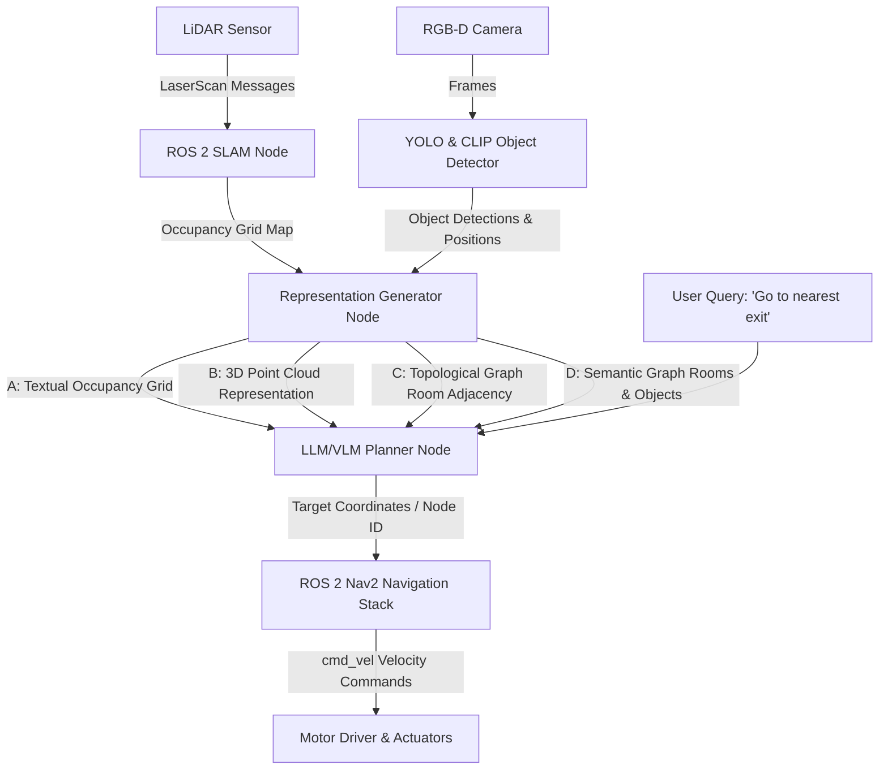
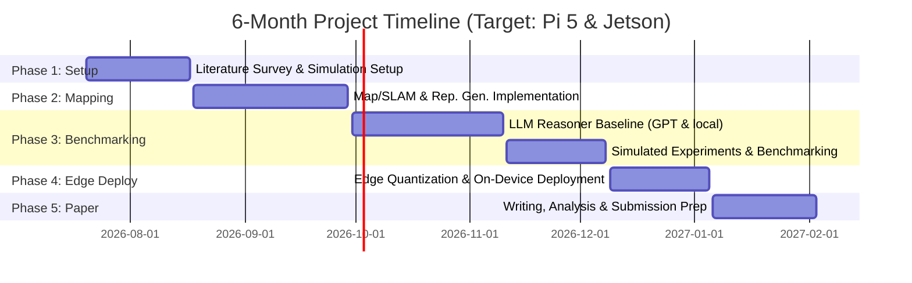

# Research Roadmap: Spatial Representations for Language-Guided Indoor Navigation

This document establishes the research roadmap and experimental design for evaluating how different LiDAR-derived map representations impact large language model (LLM) reasoning and execution on resource-constrained embedded robots.

---

## 1. Educational Overview

> [!NOTE]
> This section introduces the core concepts and architecture of the project for readers unfamiliar with robotics, SLAM, or LLM-guided planning.

### What is Language-Guided Indoor Navigation?
Traditional robot navigation requires a user to point and click a target location on a map or input exact coordinates (e.g., "Go to x=1.2, y=4.5"). **Language-guided navigation** allows users to command the robot in natural language (e.g., "Take me to the nearest exit" or "Find a quiet place for me to sit"). The robot must understand the query, interpret its map, identify the correct target, and navigate to it safely.

### Why Do We Need to Compare Map Representations?
Large Language Models (LLMs) reason using text (tokens) or images, but robots perceive the world through range sensors (LiDAR) and cameras. There are several ways to convert raw sensor data into a map that an LLM can parse:
1. **Geometric Grids**: A pixel grid showing where walls are.
2. **Point Clouds**: Millions of 3D spatial points.
3. **Topological Graphs**: A network of nodes (rooms) and edges (connections).
4. **Semantic Scene Graphs**: A graph showing rooms, their connections, and the objects inside them.

Currently, we do not know which format is best. A detailed grid provides exact geometry but uses too many tokens and can confuse the model. A graph is highly compact and easy to read, but throws away fine-grained geometric details needed to avoid new obstacles. This research systematically benchmarks these trade-offs to find the optimal representation.

### How Does the Pipeline Work?
The system operates as a continuous data pipeline:
1. **Perception**: A **LiDAR** sensor scans the room, and a camera detects objects.
2. **Mapping (SLAM)**: The robot builds a map and determines its location.
3. **Representation Generation**: The raw map is converted into one of the four representation formats.
4. **Reasoning**: The user's query and the map representation are sent to an **LLM Planner**.
5. **Execution**: The LLM outputs a target coordinate or node. The **Navigation Stack (Nav2)** computes a path, and local controllers drive the motors.

### Key ROS 2 Definitions
- **Node**: A ROS 2 Node is a single-purpose executable process that performs computation and communicates with other nodes in the robot system.
- **Topic**: A ROS 2 Topic is a named bus over which nodes exchange messages using a continuous publish-subscribe model.
- **Service**: A ROS 2 Service is a request-response communication mechanism allowing one node to request an action or data from another node and receive a direct reply.
- **Action**: A ROS 2 Action is a long-running communication mechanism consisting of a goal, progress feedback, and a final result, typically used for tasks like robot navigation.
- **Launch File**: A ROS 2 Launch File is a configuration script (written in Python, XML, or YAML) used to start and configure multiple nodes simultaneously.
- **Parameter**: A ROS 2 Parameter is a configuration setting associated with a specific node, allowing its behavior to be tuned at runtime without recompiling.

---

## 2. System Pipeline Architecture

The data flow diagram below details how raw sensor inputs are transformed through mapping, representation generation, and language reasoning to produce robot motion commands.



---

## 3. Literature Survey

This survey reviews recent studies on LiDAR-based mapping, LLM-based navigation, and edge deployments to identify research gaps.

| Citation | Year & Venue | Map Representation | LLM/VLM Used | Real Robot | Edge Deploy | Key Finding |
| :--- | :---: | :--- | :--- | :---: | :---: | :--- |
| **Xie et al.** | 2024, arXiv | Topometric Graph (osmAG) + LiDAR grid | ChatGPT-4, DeepSeek (local) | Sim Only | No | Introduced text-based topometric maps for high-level planning. No physical hardware evaluation. |
| **Ge et al.** | 2025, CVPR | 3D Point Cloud vs 2D Projections vs Text | GPT-4, others | No | No | Text and 2D projections often exceed raw 3D point cloud reasoning accuracy in standard LLMs. |
| **Song et al.** | 2024, arXiv | Textual Topological Map | Off-the-shelf LLMs | Sim Only | No | Uses text-based topological maps for routing blind users in indoor settings. |
| **Sikorski et al.** | 2024, arXiv | Voice Commands Only (No Map) | GPT-4Turbo, LLaMA2-7B Q5K | Yes | Yes (Pi Pico) | First LLM running on a microcontroller; cloud models significantly outperformed local models. |
| **Xie et al.** | 2025, arXiv | Semantic-osmAG (topo + objects) | ChatGPT, YOLO+CLIP | Yes | No | Lightweight hierarchical semantic map enables iterative target searching in campus environments. |
| **Hong et al.** | 2026, arXiv | 2.5D Instance-aware Semantic Map | Unspecified LLM, CLIP | Sim Only | No | Captures instance-level objects in 2.5D, yielding 96% size reduction over 3D scene graphs with +23% success. |
| **Rajvanshi et al.** | 2023, arXiv | 3D Scene Graph (built incrementally) | GPT-3.5, GPT-4 | Yes | No | Incremental 3D scene graphs queried to find dynamic object targets. Outperformed oracle baselines. |
| **Author et al.** | 2026, arXiv | OpenRoboVox 3D Semantic Map | GPT-4o, Qwen2.5-VL-7B | Sim Only | Partial | Integrates LLM/VLM experts directly in active SLAM exploration loops. |
| **Garg et al.** | 2024, ICRA | Segment-Based Topological Graph | GPT-4, CLIP | Yes | No | Image segments serve as topological nodes; LLM parses relational queries for Dijkstra planning. |
| **Liu et al.** | 2025, arXiv | Topological Memory Graph | Unspecified LLM | Yes | No | Dynamic topological graphs handle large, dynamic spaces better than static maps. |
| **Halama et al.** | 2025, Sci. Rep. | Semantic Vision-based Map | GPT-4V, Gemini | Sim Only | No | Couples object database with LLMs for navigation query resolution. |
| **Kumar et al.** | 2024, arXiv | Hierarchical Scene Graph (rooms/objects) | LLaMA3, CLIP | Yes (Go2) | Partial | Performed real-time mapping/perception on-board Jetson; LLM reasoning executed in the cloud. |
| **Zu et al.** | 2024, arXiv | 2D LiDAR Occupancy + Sketch | GPT-4 | Yes | No | Combines sketches and natural language for task parsing, using SAC reinforcement learning. |

---

## 4. Research Gaps & Open Questions

Based on the literature survey, we have identified several gaps that this project will address:

1. **Lack of Representation Benchmarks**: Most studies choose a single map format (e.g., scene graphs or grid maps) and build pipelines around it. There is no systematic comparison of how different representations affect planning accuracy, latency, and token consumption under identical conditions.
2. **LiDAR-LLM Gap on Constrained Edge Hardware**: Existing projects that deploy LLMs on real robots either run them in the cloud or rely on high-power computing blocks (like dual NVIDIA Jetson Orin boards). Running a complete SLAM-to-representation-to-LLM planning stack entirely on edge hardware like a **Raspberry Pi 5** remains largely unexplored.
3. **Quantized Reasoning Decay**: It is unknown how much spatial reasoning degrades when large models (like Llama-3-70B) are compressed into small, quantized versions (like Qwen-2.5-3B or Gemma-2-2B GGUF) for edge deployment.

---

## 5. Proposed Experimental Plan

To address these gaps, we propose a modular pipeline to evaluate map formats and local models.

```
+------------------+     +-------------------+     +------------------+
| Map Formats:     |     | LLM Reasoners:    |     | Deployment Target|
| - Occupancy Grid | --> | - GPT-4o (Cloud)  | --> | - PC (Baseline)  |
| - Point Cloud    |     | - Llama 3 8B      |     | - Jetson Orin    |
| - Topo Graph     |     | - Qwen 2.5 3B     |     | - Raspberry Pi 5 |
| - Semantic Graph |     | - Gemma 2 2B      |     |                  |
+------------------+     +-------------------+     +------------------+
```

### 5.1 Datasets and Environments
- **Simulation**: Matterport3D and HM3D scanned environments in Gazebo/Classic.
- **Physical**: Custom scans of office/lab layouts using the RPLidar sensor on our autonomous platform.

### 5.2 Map Representations to Generate
1. **Representation A (Raw Occupancy Grid)**: Serialized 2D grid matrix where cells are classified as free (0), occupied (1), or unknown (-1).
2. **Representation B (Point Cloud)**: Sparsely sampled coordinate sets representing boundaries and obstacle locations.
3. **Representation C (Topological Graph)**: Adjacency list showing connected rooms and corridors (e.g., `Room_A <-> Hallway <-> Exit`).
4. **Representation D (Semantic Scene Graph)**: Adjacency list enriched with object identifiers and their parent nodes (e.g., `Room_A contains: [chair, table]`).

### 5.3 Tasks & Metrics
- **ObjectGoalNav**: "Navigate to the dining table."
- **RoomGoalNav**: "Go to the kitchen."
- **Composite reasoning**: "Inspect every room and locate the toolbox."
- **Evaluation Metrics**:
  - **Success Rate (SR)**: Percentage of runs that reach within 1m of the goal.
  - **Success weighted by Path Length (SPL)**: Planning path efficiency.
  - **Token Consumption**: Number of input and output tokens used per planning query.
  - **Planning Latency**: Time from query input to target coordinates output.
  - **Memory Footprint**: RAM usage of the running pipeline (especially on edge hardware).

### 5.4 Edge Computing & Compression
- Compile local models using `llama.cpp` or `Ollama`.
- Apply **GGUF quantization** (4-bit/5-bit) to reduce memory overhead.
- Measure inference speed (tokens/sec) and prompt evaluation time on the Raspberry Pi 5.

---

## 6. Project Timeline (6-Month Gantt)

The 6-month roadmap allocates time for setup, implementation, benchmark runs, edge deployment, and scientific writing.



---

## 7. Action Plan: Month 1 Detailed Tasks

This checklist lists the immediate tasks to execute during the first month.

### Week 1: Environment & Tooling Preparation
- [ ] Configure ROS 2 Humble workspace environment.
- [ ] Run launch files for RViz and SLAM Toolbox.
- [ ] Integrate and calibrate the RPLidar driver on the physical platform.
- [ ] Run teleop control to verify laser scan publishing.

### Week 2: Map Generation & Exporting
- [ ] Generate 2D occupancy grid maps of the simulation environment.
- [ ] Export map output files (`.pgm` and `.yaml`).
- [ ] Implement a helper script in python to read the raw grid map matrices.

### Week 3: Representation Generators
- [ ] Write a script to convert occupancy grid matrices into a simplified Topological Graph (rooms and corridors).
- [ ] Implement a node to extract coordinates representing object centers and map boundaries (semantic metadata placeholder).
- [ ] Document map translation formats in `docs/architecture/representation-formats.md`.

### Week 4: Benchmark Dataset & API Tests
- [ ] Set up connection scripts to query Gemini and GPT-4o API.
- [ ] Create a benchmark dataset of 30 navigation queries testing spatial logic.
- [ ] Test the topological graph and occupancy grid inputs to assess API response accuracy and token usage.

---

## 8. Potential Paper Directions & Publications

### Working Title
*GeoReason: Evaluating Spatial Representations for Language-Guided Reasoning over LiDAR-Derived Indoor Maps*

### Expected Contributions
1. **Benchmark Comparison**: The first study to directly compare how 2D occupancy, point clouds, topological graphs, and semantic graphs affect planning accuracy in LLMs.
2. **On-Edge Validation**: Concrete performance benchmarks showing memory footprint, planning latency, and viability of running quantized LLMs on a Raspberry Pi 5.
3. **Pipeline Integration**: An open-source ROS 2 package bridging SLAM maps and Nav2 with local LLM planners.
